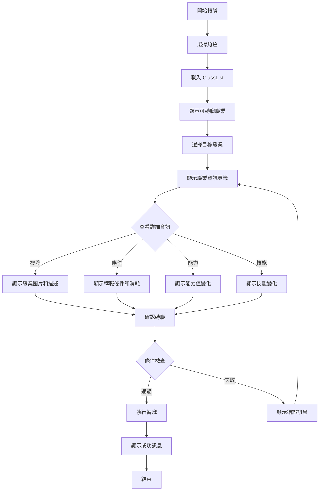

# Enhanced Class Change System - Merged Solution Design

## 概述 / Overview

本文檔描述了結合 NNNN_Enhanced_ClassChangeSystem 和 NRP_ClassChangeScene 兩個系統優勢的理想解決方案。新系統以參數(parameter)、插件(plugin)、命令(command)、標籤(note tag)四個核心設計為基礎，提供更完整且靈活的轉職系統。

---

## 🎯 核心設計理念 / Core Design Philosophy

### 設計原則
1. **統一管理**: 使用增強版 ClassList 統一管理職業條件和資源消耗
2. **靈活配置**: 支援多種條件檢查和資源消耗方式
3. **用戶體驗**: 現代化界面設計，提供清晰的視覺反饋
4. **多語言支援**: 智能語言切換系統
5. **可擴展性**: 模組化設計，易於擴展新功能

---

## 🏗️ 系統架構 / System Architecture

### 核心模組結構

```
 Enhanced Class Change System
 ├── Core Logic Layer
 │   ├── ClassChangeManager (主控制器)
 │   ├── ConditionValidator (條件驗證器)
 │   ├── ResourceManager (資源管理器)
 │   └── PreviewCalculator (預覽計算器)
 ├── Data Management Layer
 │   ├── EnhancedClassList (增強職業清單)
 │   ├── LanguageManager (語言管理器)
 │   └── ConfigurationManager (配置管理器)
 └── UI Presentation Layer
     ├── Scene_EnhancedClassChange (主場景)
     ├── Window_ClassSelection (職業選擇窗口)
     ├── Window_ClassInfoTabs (分離式資訊頁籤窗口)
     └── Window_ConfirmationDialog (確認對話框)
```

---

## 📋 增強版 ClassList 設計 / Enhanced ClassList Design

### ClassList 結構定義

取代原本的 note tag 設定方式，改用參數化的 ClassList 配置：

```javascript
// Enhanced ClassList Structure
const EnhancedClassList = [
  {
    classId: 2,                    // 目標職業ID
    name: "戰士",                   // 職業名稱 (可選，用於顯示)
    description: "強壯的近戰職業",   // 職業描述
    
    // 轉職條件
    conditions: {
      fromClasses: [1, 3],         // 可轉職來源職業ID列表
      requiredLevel: 10,           // 最低等級要求
      requiredParams: {            // 參數要求
        hp: 100,
        mp: 50,
        atk: 30,
        def: 25,
        mat: 20,
        mdf: 20,
        agi: 35,
        luk: 15
      },
      requiredSwitches: [1, 5],    // 必須開啟的開關
      requiredVariables: {         // 變數條件
        1: { min: 10, max: 50 },   // 變數1需在10-50之間
        3: { min: 1 }              // 變數3需>=1
      },
      customScript: "$gameParty.hasItem($dataItems[10])" // 自定義腳本條件
    },
    
    // 資源消耗
    costs: {
      gold: 5000,                  // 金錢消耗
      items: [                     // 道具消耗
        { id: 3, amount: 2 },      // 道具ID 3，數量 2
        { id: 5, amount: 1 }       // 道具ID 5，數量 1
      ],
      exp: 100                     // 經驗值消耗 (可選)
    },
    
    // 顯示設定
    display: {
      enabled: true,               // 是否在列表中顯示
      icon: 16,                    // 圖標ID
      color: "#ffffff",            // 文字顏色
      image: "Warrior.png"         // 職業圖片
    },
    
    // 角色圖像設定 (繼承自NRP系統)
    images: {
      face: "Actor1_Warrior",      // 臉圖
      character: "Actor1_Warrior", // 行走圖
      battler: "Actor1_Warrior",   // 戰鬥圖
      picture: "ClassPic_Warrior"  // 職業圖片
    }
  }
];
```

---

## 🔧 插件命令系統 / Plugin Command System

### 核心命令

#### 1. 開啟轉職畫面
```javascript
// Command: OpenClassChange
// Parameters: actorId (optional)
PluginManager.registerCommand("OpenClassChange", args => {
    const actorId = parseInt(args.actorId) || 0;
    SceneManager.push(Scene_EnhancedClassChange);
    if (actorId > 0) {
        SceneManager.prepareNextScene(actorId);
    }
});
```

#### 2. 強制轉職命令 (新增)
```javascript
// Command: ForceClassChange
// Parameters: actorId, classId, isForce
PluginManager.registerCommand("ForceClassChange", args => {
    const actorId = parseInt(args.actorId);
    const classId = parseInt(args.classId);
    const isForce = args.isForce === 'true';
    
    const actor = $gameActors.actor(actorId);
    if (!actor) return;
    
    if (isForce) {
        // 跳過所有條件檢查，直接轉職
        actor.changeClass(classId, false);
        $gameMessage.add(`${actor.name()} 已強制轉職為 ${$dataClasses[classId].name}！`);
    } else {
        // 正常條件檢查流程
        const result = ClassChangeManager.validateConditions(actor, classId);
        if (result.success) {
            ClassChangeManager.executeClassChange(actor, classId);
        } else {
            $gameMessage.add(result.message);
        }
    }
});
```

#### 3. 動態更新職業清單
```javascript
// Command: UpdateClassList
// Parameters: newClassList (JSON string)
PluginManager.registerCommand("UpdateClassList", args => {
    try {
        const newList = JSON.parse(args.newClassList);
        ClassChangeManager.updateClassList(newList);
    } catch (e) {
        console.error("Invalid ClassList JSON:", e);
    }
});
```

---

## 🎨 UI 設計改進 / UI Design Improvements

### 主要改進點

#### 1. 擴大可見範圍
- 將視窗底部拉至螢幕最低處
- 優化視窗布局，最大化內容顯示區域
- 調整邊距和間距，提供更寬敞的視覺體驗

#### 2. 分離式資訊頁籤系統

原本的轉職資訊視窗頁籤將分離為獨立的小視窗，支援橫向選擇：

```javascript
// 新的頁籤系統設計
class Window_ClassInfoTabs extends Window_HorzCommand {
    constructor(rect) {
        super(rect);
        this._currentTab = 0;
        this._targetWindow = null;
    }
    
    makeCommandList() {
        this.addCommand(LanguageManager.getText('tabOverview'), 'overview');
        this.addCommand(LanguageManager.getText('tabConditions'), 'conditions');
        this.addCommand(LanguageManager.getText('tabStats'), 'stats');
        this.addCommand(LanguageManager.getText('tabSkills'), 'skills');
    }
    
    setTargetWindow(window) {
        this._targetWindow = window;
    }
    
    callOkHandler() {
        if (this._targetWindow) {
            this._targetWindow.switchTab(this.index());
        }
        super.callOkHandler();
    }
}
```

#### 3. 四個頁籤內容

1. **職業概覽** (新增，最左邊)
   - 參照 NRP_ClassChangeScene 的資料與圖片顯示布局
   - 顯示職業圖片、名稱、描述
   - 移除能力變化顯示 (因為已有專門頁籤)
   
2. **轉職條件**
   - 顯示所有轉職條件和資源消耗
   - 條件滿足狀態的視覺指示
   
3. **能力比較**
   - 轉職前後能力值對比
   - 變化量的顏色標示
   
4. **技能變化**
   - 新習得技能和失去技能的列表
   - 技能圖標和描述顯示

---

## 🌐 多語言系統 / Multilingual System

### 語言字典設計

使用統一的字典物件管理所有文字，支援四種語言配置：

```javascript
class LanguageManager {
    static initialize() {
        this._currentLanguage = this.detectSystemLanguage();
        this._textDictionary = {};
    }
    
    static detectSystemLanguage() {
        const systemLang = navigator.language || navigator.userLanguage;
        if (systemLang.includes('zh-TW') || systemLang.includes('zh-Hant')) {
            return 'zhTW';
        } else if (systemLang.includes('zh-CN') || systemLang.includes('zh-Hans')) {
            return 'zhCN';
        } else if (systemLang.includes('ja')) {
            return 'ja';
        } else {
            return 'en';
        }
    }
    
    static registerText(key, textObject) {
        this._textDictionary[key] = {
            custom: textObject.custom || '',     // 外部參數自訂輸入
            ja: textObject.ja || '',             // 日文
            en: textObject.en || '',             // 英文
            zhTW: textObject.zhTW || '',         // 繁體中文
            zhCN: textObject.zhCN || ''          // 簡體中文 (額外支援)
        };
    }
    
    static getText(key) {
        const textObj = this._textDictionary[key];
        if (!textObj) return key;
        
        // 優先使用自訂輸入
        if (textObj.custom) {
            return textObj.custom;
        }
        
        // 根據系統語言自動選擇
        return textObj[this._currentLanguage] || textObj.en || key;
    }
}

// 預設文字字典
const DEFAULT_TEXTS = {
    // UI 標籤
    'tabOverview': {
        ja: '概要',
        en: 'Overview',
        zhTW: '職業概覽',
        zhCN: '职业概览'
    },
    'tabConditions': {
        ja: '転職条件',
        en: 'Conditions',
        zhTW: '轉職條件',
        zhCN: '转职条件'
    },
    'tabStats': {
        ja: '能力比較',
        en: 'Stats Comparison',
        zhTW: '能力比較',
        zhCN: '能力比较'
    },
    'tabSkills': {
        ja: 'スキル変化',
        en: 'Skill Changes',
        zhTW: '技能變化',
        zhCN: '技能变化'
    },
    
    // 系統訊息
    'confirmChange': {
        ja: '%1を%2に転職させますか？',
        en: 'Change %1 to %2?',
        zhTW: '確定將 %1 轉職為 %2？',
        zhCN: '确定将 %1 转职为 %2？'
    },
    'changeSuccess': {
        ja: '%1が%2に転職しました！',
        en: '%1 changed to %2!',
        zhTW: '%1 已轉職為 %2！',
        zhCN: '%1 已转职为 %2！'
    },
    'insufficientResources': {
        ja: 'リソースが不足しています',
        en: 'Insufficient resources',
        zhTW: '資源不足',
        zhCN: '资源不足'
    }
};
```

---

## ⚙️ 參數配置系統 / Parameter Configuration

### 插件參數結構

```javascript
// 主要配置參數
const PLUGIN_PARAMETERS = {
    // 基本設定
    showMenuCommand: true,
    menuCommandText: {
        custom: '',
        ja: '転職',
        en: 'Class Change',
        zhTW: '轉職',
        zhCN: '转职'
    },
    
    // ClassList 配置
    enhancedClassList: [], // 使用上述 EnhancedClassList 結構
    
    // UI 設定
    windowSettings: {
        expandToBottom: true,        // 視窗擴展至底部
        tabWindowHeight: 60,         // 頁籤視窗高度
        infoWindowMargin: 10,        // 資訊視窗邊距
        enableTabSeparation: true    // 啟用分離式頁籤
    },
    
    // 顯示設定
    displaySettings: {
        showClassImages: true,
        showParameterChanges: true,
        showSkillChanges: true,
        animationSpeed: 300
    },
    
    // 語言設定
    languageSettings: {
        autoDetect: true,
        defaultLanguage: 'en',
        customTexts: {}  // 允許用戶覆蓋預設文字
    }
};
```

---

## 🔄 功能流程邏輯 / Functional Flow Logic

### 主要流程設計



### 核心邏輯實現

#### 1. 條件驗證邏輯
```javascript
class ConditionValidator {
    static validateAll(actor, classData) {
        const results = {
            success: true,
            failures: [],
            warnings: []
        };
        
        // 檢查來源職業
        if (!this.checkFromClasses(actor, classData.conditions.fromClasses)) {
            results.failures.push('invalidFromClass');
        }
        
        // 檢查等級要求
        if (!this.checkLevel(actor, classData.conditions.requiredLevel)) {
            results.failures.push('insufficientLevel');
        }
        
        // 檢查參數要求
        if (!this.checkParameters(actor, classData.conditions.requiredParams)) {
            results.failures.push('insufficientParams');
        }
        
        // 檢查資源消耗
        if (!this.checkResources(classData.costs)) {
            results.failures.push('insufficientResources');
        }
        
        // 檢查自訂腳本
        if (!this.checkCustomScript(classData.conditions.customScript)) {
            results.failures.push('customConditionFailed');
        }
        
        results.success = results.failures.length === 0;
        return results;
    }
    
    static checkFromClasses(actor, allowedClasses) {
        if (!allowedClasses || allowedClasses.length === 0) return true;
        return allowedClasses.includes(actor.currentClass().id);
    }
    
    static checkLevel(actor, requiredLevel) {
        return !requiredLevel || actor.level >= requiredLevel;
    }
    
    static checkParameters(actor, requiredParams) {
        if (!requiredParams) return true;
        
        for (const [param, value] of Object.entries(requiredParams)) {
            const paramId = this.getParamId(param);
            if (actor.param(paramId) < value) {
                return false;
            }
        }
        return true;
    }
    
    static checkResources(costs) {
        if (!costs) return true;
        
        // 檢查金錢
        if (costs.gold && $gameParty.gold() < costs.gold) {
            return false;
        }
        
        // 檢查道具
        if (costs.items) {
            for (const item of costs.items) {
                if ($gameParty.numItems($dataItems[item.id]) < item.amount) {
                    return false;
                }
            }
        }
        
        return true;
    }
}
```

#### 2. 資源管理邏輯
```javascript
class ResourceManager {
    static consumeResources(costs) {
        if (!costs) return;
        
        // 消耗金錢
        if (costs.gold) {
            $gameParty.loseGold(costs.gold);
        }
        
        // 消耗道具
        if (costs.items) {
            for (const item of costs.items) {
                $gameParty.loseItem($dataItems[item.id], item.amount);
            }
        }
        
        // 消耗經驗值 (如果設定)
        if (costs.exp) {
            // 實現經驗值消耗邏輯
        }
    }
    
    static getResourceSummary(costs) {
        const summary = [];
        
        if (costs.gold) {
            summary.push({
                type: 'gold',
                amount: costs.gold,
                available: $gameParty.gold(),
                sufficient: $gameParty.gold() >= costs.gold
            });
        }
        
        if (costs.items) {
            for (const item of costs.items) {
                const available = $gameParty.numItems($dataItems[item.id]);
                summary.push({
                    type: 'item',
                    item: $dataItems[item.id],
                    amount: item.amount,
                    available: available,
                    sufficient: available >= item.amount
                });
            }
        }
        
        return summary;
    }
}
```

---

## 🎯 實現優先級 / Implementation Priority

### Phase 1: 核心架構
1. 建立 EnhancedClassList 資料結構
2. 實現 LanguageManager 多語言系統
3. 建立基礎的條件驗證和資源管理邏輯

### Phase 2: UI 改進
1. 重新設計主場景布局，擴大可見範圍
2. 實現分離式頁籤系統
3. 新增職業概覽頁籤

### Phase 3: 進階功能
1. 實現強制轉職插件命令
2. 新增動態職業清單更新功能
3. 完善錯誤處理和用戶反饋

### Phase 4: 優化和測試
1. 性能優化
2. 兼容性測試
3. 用戶體驗優化

---

## 📝 總結 / Summary

本設計方案成功整合了兩個系統的優勢：

**來自 NNNN Enhanced 系統的優勢：**
- 現代化的 UI 設計和用戶體驗
- 靈活的資源消耗機制
- 清晰的條件驗證邏輯

**來自 NRP ClassChange 系統的優勢：**
- 成熟的 ClassList 管理機制
- 豐富的圖像綁定功能
- 穩定的核心架構

**新增的創新功能：**
- 統一的多語言管理系統
- 分離式頁籤設計
- 強制轉職命令
- 擴大的視覺顯示範圍

這個合併方案提供了一個功能完整、用戶友好、易於擴展的轉職系統，能夠滿足各種不同類型 RPG 遊戲的需求。